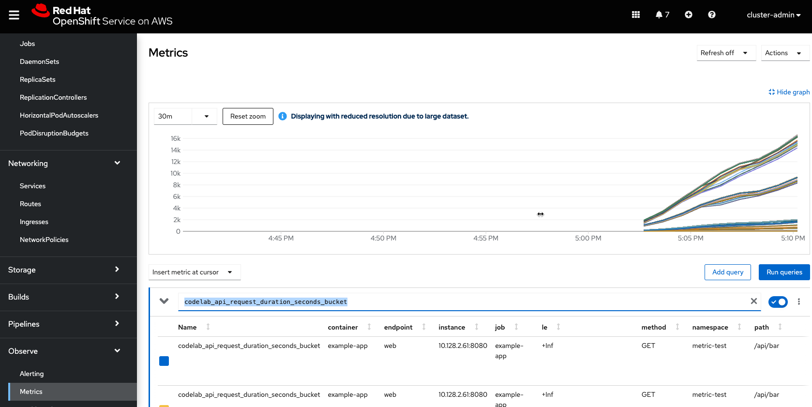

# metrics-sample-app

git clone https://github.com/kmcolli/metrics-sample-app

oc new-app metrics-sample-app

oc apply -f metrics-sample-app

In OpenShift browse from Administrator -> Observe -> Metrics 
enter codelab_api_request_duration_seconds_bucket as the query

Metrics show show something like this:

